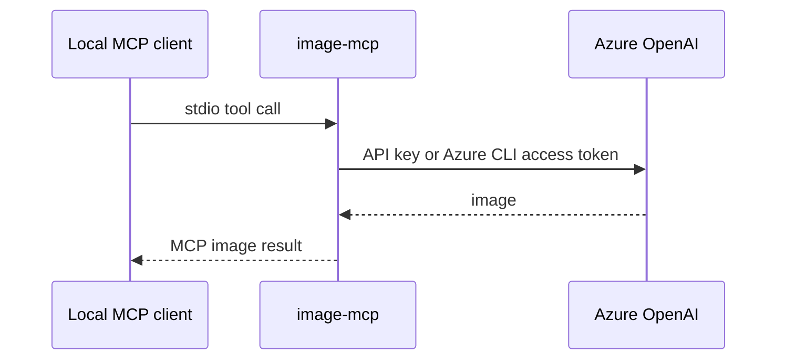
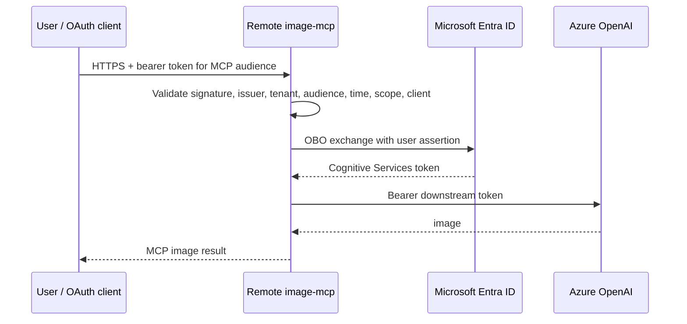

# ADR-007: Three-mode Azure authentication

- **Status:** Accepted
- **Date:** 2026-08-10
- **Scope:** Azure OpenAI provider and remote MCP authentication

## Context

`image-mcp` currently supports Azure OpenAI with `IMAGE_API_KEY`, while HTTP MCP access is independently protected by the static `IMAGE_MCP_API_KEY`. Enterprise and local keyless usage require two additional outbound Azure modes without breaking existing users:

1. `api_key` — current behavior;
2. `azure_cli` — local developer identity acquired from Azure CLI;
3. `on_behalf_of` — a remote HTTP MCP exchanges the authenticated user's delegated token for Azure OpenAI access.

Inbound MCP authentication and outbound Azure authentication are separate trust boundaries and must never be represented by one setting or one token.

## Decision

### Outbound Azure mode

Add `IMAGE_AZURE_AUTH_MODE`:

- `api_key` (compatibility default)
- `azure_cli`
- `on_behalf_of`

Accept `api-key`, `az-cli`, and `obo` only as normalized aliases. Diagnostics and documentation use canonical values.

### Inbound MCP mode

Add `IMAGE_MCP_AUTH_MODE`:

- `none` — stdio only, or explicitly trusted local HTTP;
- `static_bearer` — current `IMAGE_MCP_API_KEY` behavior;
- `entra` — Entra OAuth resource-server validation.

Transport defaults remain secure:

- stdio implies `none`;
- HTTP implies `static_bearer` unless OBO selects `entra`;
- OBO requires HTTP and `entra`.

### Mode contract

| Azure mode | Required | Forbidden/inapplicable | Typical transport |
|---|---|---|---|
| `api_key` | `IMAGE_PROVIDER=azure`, `IMAGE_API_KEY`, `IMAGE_BASE_URL`, `IMAGE_DEPLOYMENT` | Entra OBO fields | stdio or HTTP |
| `azure_cli` | Azure provider, endpoint, deployment; prior `az login` | `IMAGE_API_KEY` is ignored with a safe warning | stdio |
| `on_behalf_of` | Azure provider, endpoint, deployment, HTTP, Entra tenant/client/audience/scope, confidential server credential | stdio, static MCP bearer, API key fallback | HTTPS |

Compatibility rule: when `IMAGE_PROVIDER=azure`, the mode is absent, and `IMAGE_API_KEY` exists, resolve to `api_key`. Never infer Azure CLI merely because `az` is installed. Never silently fall back from an explicit keyless mode to an API key.

## Identity boundaries





The incoming MCP token is never relayed directly to Azure OpenAI. OBO credentials are request-contextual, not global provider state.

## Azure CLI mode

Use `AzureCliCredential` and `getBearerTokenProvider` from `@azure/identity`, scoped to:

```text
https://cognitiveservices.azure.com/.default
```

This explicit credential gives predictable UX. `DefaultAzureCredential` is not used for a mode named `azure_cli`, because it may select another source. Optional tenant selection is supported. Azure RBAC remains authoritative.

## OBO mode

The remote MCP is an OAuth resource server. Before tool execution it validates:

- JWT signature using Entra OIDC/JWKS;
- exact trusted issuer and tenant policy;
- MCP audience;
- `exp` and `nbf`;
- delegated `mcp.access` scope;
- user identity (`oid`/`sub`);
- allowed client application (`azp`/`appid`) when configured;
- rejection of app-only tokens where user delegation is required.

The confidential middle tier exchanges the assertion for `https://cognitiveservices.azure.com/.default`. Prefer workload/managed identity federation; certificate credentials are the next choice; a Key Vault-backed rotating client secret is fallback only.

Downstream token cache keys use a hash of tenant, user, client and scope. Entries expire before token expiry. Raw assertions/tokens are never keys, logs, metrics, disk data, or MCP responses. Concurrent users never share clients or credentials.

## Invalid combinations

Startup fails with actionable messages for:

- Azure auth mode with a non-Azure provider;
- `api_key` without `IMAGE_API_KEY`;
- `azure_cli` with a required API key or OBO-only fields;
- OBO over stdio;
- OBO without inbound `entra`;
- OBO combined with static MCP bearer auth;
- OBO missing tenant, client, audience, delegated scope, or confidential credential;
- ambiguous simultaneous credential modes.

## Threat model and mitigations

| Threat | Mitigation |
|---|---|
| Stolen static key | Secret backends/`*_FILE`, rotation, masking; recommend keyless modes |
| Token replay to another API | Exact audience and issuer validation |
| Forged or stale JWT | JWKS signature, lifetime and key-rotation validation |
| Confused deputy | Validate caller scope/client; OBO preserves caller authorization; least-privilege Azure RBAC |
| Cross-user credential leak | Request context, cache partitioning, concurrency tests, no global OBO client |
| Token leakage | Never log/persist tokens; sentinel secret tests; hashed identity telemetry |
| Silent credential downgrade | Explicit mode, no key fallback from keyless modes |
| Excessive tool access | Tool allowlisting, per-caller authorization and audit |
| Malicious redirect/client | Exact registered redirect URIs, PKCE, preauthorized clients/consent |
| Metadata/JWKS outage | Bounded cache, fail closed after safe cache expiry, observable errors |

## User experience

A user chooses one mode and receives mode-specific validation and `auth doctor` guidance. Documentation starts with a decision table. Existing API-key users make no change. Azure CLI users run `az login` and provide no key. OBO end users provide only the service URL and complete interactive sign-in; app registration and deployment steps are separated by administrator role.

## Consequences

- Azure client creation must move behind an auth-aware factory.
- OBO requires validated request identity propagation.
- Static bearer remains supported, but is not an Entra substitute.
- The three modes require independent integration/security testing and documentation.
- Sovereign-cloud authority/scope support is deferred unless explicitly configured and tested.

## References

- [Secure Azure MCP Server](https://learn.microsoft.com/azure/developer/azure-mcp-server/security)
- [Azure MCP Server OBO](https://learn.microsoft.com/azure/developer/azure-mcp-server/how-to/deploy-remote-mcp-server-on-behalf-of)
- [Azure OpenAI TypeScript authentication](https://learn.microsoft.com/javascript/api/overview/azure/openai-readme)
- [Azure OpenAI image generation quickstart](https://learn.microsoft.com/azure/ai-foundry/openai/dall-e-quickstart)
- [Secure MCP servers with API Management](https://learn.microsoft.com/azure/api-management/secure-mcp-servers)
